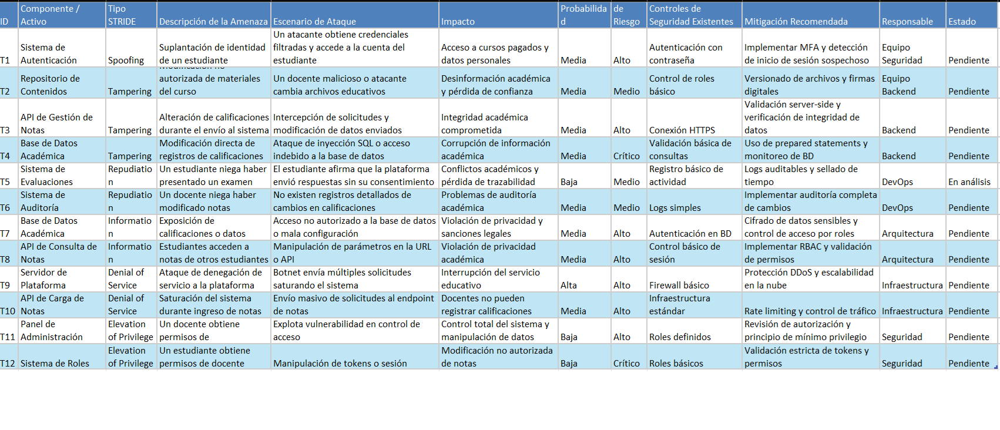

# 🗒️ Registro de Trabajo en Clase - Taller 5

## 📆 Fecha de la sesión
14/03/2026

## 👥 Integrantes presentes
- Valentina Ruiz
- Darek Aljuri
- Santiago Soler

## 🧠 Actividades realizadas en clase

Describa brevemente qué se hizo durante la sesión:

- ¿Qué se discutió con el equipo?
  
Durante la sesión se analizó el funcionamiento general de la plataforma EdukIT y los procesos críticos que maneja, especialmente aquellos que involucran información sensible de los estudiantes, como datos personales, calificaciones y acceso a contenidos educativos.

El equipo discutió cuáles eran los flujos más importantes del sistema y se evaluaron diferentes opciones como el acceso a cursos, el procesamiento de pagos y la gestión de evaluaciones. Finalmente se decidió trabajar sobre el flujo de carga y gestión de notas, ya que este proceso involucra varios componentes del sistema y afecta directamente la integridad de la información académica.

También se revisó cómo interactúan los distintos roles del sistema (estudiante, docente y administrador) con los componentes principales de la plataforma, como el sistema de autenticación, las APIs, el repositorio de contenidos y la base de datos académica. A partir de esta discusión se identificaron posibles puntos donde podrían existir vulnerabilidades o amenazas de seguridad.

- ¿Qué decisiones de modelado se tomaron?

El equipo decidió aplicar el marco de modelado de amenazas STRIDE, con el objetivo de identificar riesgos de seguridad relacionados con suplantación de identidad, manipulación de datos, divulgación de información, negación de servicio y escalamiento de privilegios.

Se tomó la decisión de analizar el flujo de carga y consulta de notas académicas, debido a que este proceso involucra múltiples componentes críticos del sistema, como:

- Sistema de autenticación
- API de gestión de notas
- API de consulta de notas
- Base de datos académica
- Sistema de auditoría
- Panel de administración

Además, se decidió organizar el análisis mediante una tabla de amenazas, donde cada amenaza identificada se clasifica según su tipo STRIDE y se describen aspectos como el escenario de ataque, el impacto potencial, la probabilidad de ocurrencia y las medidas de mitigación recomendadas.

También se acordó incluir controles de seguridad existentes y proponer mejoras de seguridad, con el fin de fortalecer la protección de los datos académicos y el acceso a los recursos del sistema.
  
- ¿Qué parte del trabajo se alcanzó a desarrollar?

Durante la sesión se logró desarrollar el análisis inicial de amenazas utilizando el modelo STRIDE aplicado al flujo seleccionado del sistema EdukIT.

En particular, se identificaron 12 posibles amenazas de seguridad que afectan diferentes componentes de la plataforma. Estas amenazas incluyen escenarios como:

- Suplantación de identidad de estudiantes mediante robo de credenciales.
- Manipulación de contenidos o calificaciones dentro del sistema.
- Acceso no autorizado a información académica.
- Ataques de denegación de servicio que podrían afectar la disponibilidad de la plataforma.
- Escalamiento de privilegios donde un usuario obtiene permisos superiores a los que le corresponden.

Para cada amenaza se definieron elementos clave del análisis como descripción de la amenaza, escenario de ataque, impacto potencial en el sistema, probabilidad de ocurrencia, nivel de riesgo, controles de seguridad existentes, estrategias de mitigación recomendadas.

Como resultado de la sesión, se obtuvo una tabla estructurada de análisis STRIDE, que servirá como base para continuar evaluando la seguridad del sistema y proponer mejoras en los mecanismos de protección de la información dentro de la plataforma EdukIT.

## 🧩 Boceto inicial del modelo

## 🔁 Tareas definidas para complementar el taller

Anote las responsabilidades acordadas entre los miembros del equipo para completar la entrega final:

| Tarea asignada | Responsable | Fecha estimada |
|----------------|-------------|----------------|
| Modelado final en draw.io | Santiago Soler| 14/03 |
| Redacción del informe     | Valentina Ruiz | 14/03 |
| Investigación y referencias | Darek Aljuri | 14/03 |

---

_Este documento resume el trabajo colaborativo realizado durante la sesión del taller 5 en el curso AREM - Universidad de La Sabana._
